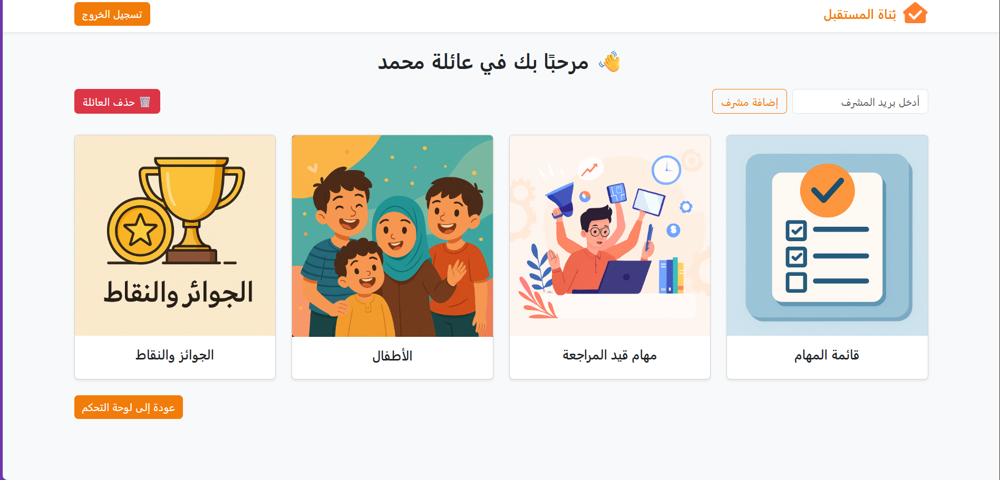
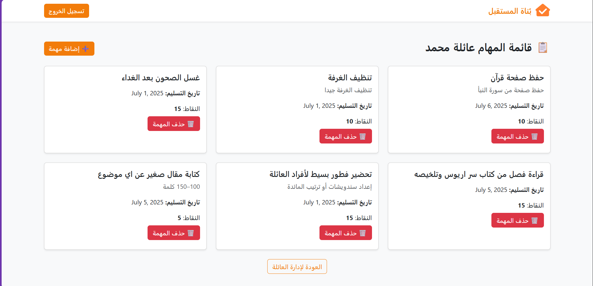
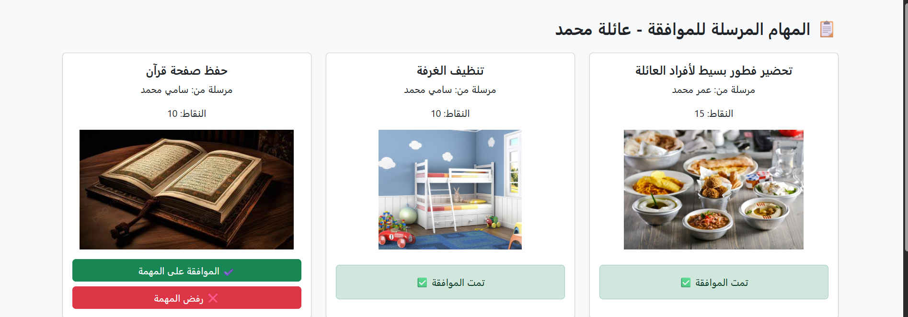
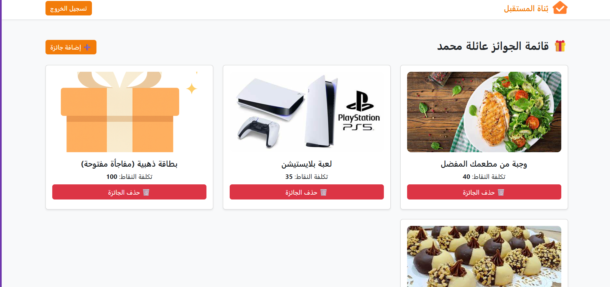
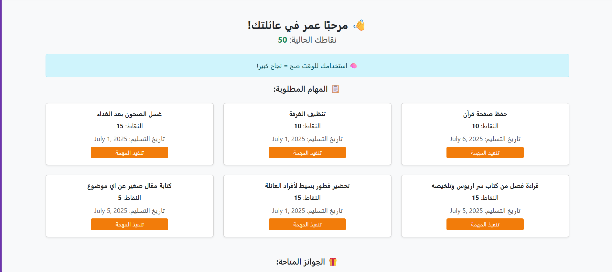
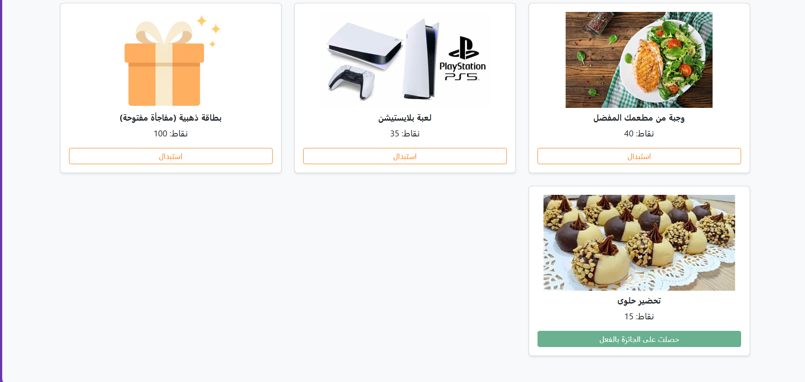
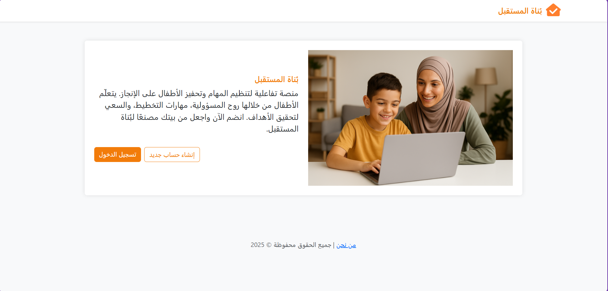
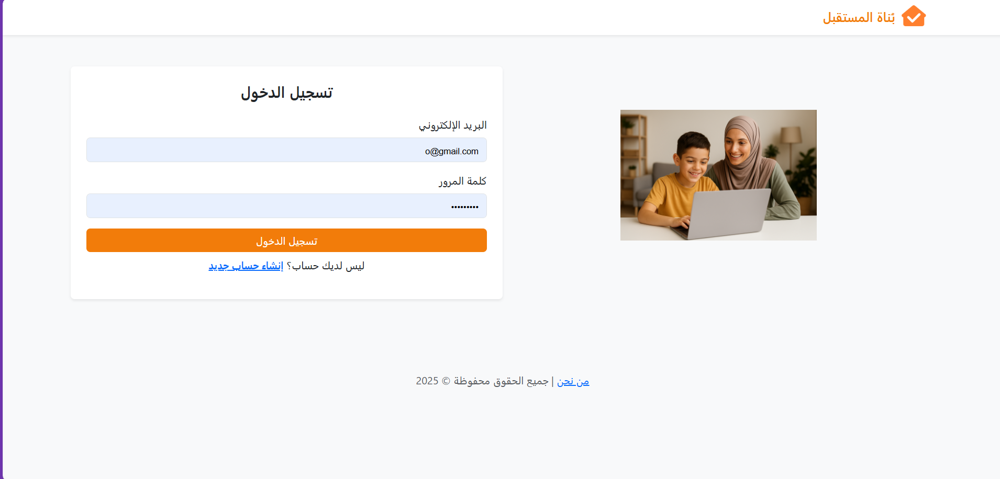

# 🏠 MissionFamily – بناة المستقبل

MissionFamily is an interactive and educational platform designed to help children learn responsibility at home through task assignment, point collection, and rewards — all built with Django.

---

## 📌 Table of Contents

- [Introduction](#introduction)
- [Project Features](#project-features)
- [User Interface](#user-interface)
- [Running the Project Locally](#running-the-project-locally)
- [Database Configuration](#database-configuration)
- [Screenshots](#screenshots)
- [Technologies Used](#technologies-used)

---

## 🧩 Introduction

MissionFamily enables families to digitally manage household responsibilities.  
Parents can assign tasks and review progress, while children complete tasks, upload proof, and earn points.

---

## ✅ Project Features

- 👨‍👩‍👧‍👦 Separate dashboards for parents and children  
- ✅ Parents can create families, add children, publish tasks, and review submissions  
- 📸 Children can view tasks, submit proof (text/photo), and track progress  
- 🏆 Points and rewards system  
- 📱 Fully responsive design (mobile, tablet, desktop)  
- 🔐 Secure login with encrypted passwords

---

## 🎨 User Interface

Built using:
- **Bootstrap** for layout and responsiveness  
- **Custom CSS** for style and status icons:  
  - ✅ Approved  
  - ⏳ Pending  
  - ❌ Rejected

---

## 💻 Running the Project Locally

```bash
git clone https://github.com/username/missionfamily.git
cd missionfamily
python -m venv venv
source venv/bin/activate  # On Windows: venv\Scripts\activate
pip install -r requirements.txt
python manage.py makemigrations
python manage.py migrate
python manage.py runserver
```

---

## 🛠️ Database Configuration

This project uses **MySQL** as the database engine.  
Make sure to update your `settings.py` as follows:

```python
DATABASES = {
    'default': {
        'ENGINE': 'django.db.backends.mysql',
        'NAME': 'your_db_name',
        'USER': 'your_db_user',
        'PASSWORD': 'your_db_password',
        'HOST': 'localhost',
        'PORT': '3306',
    }
}
```

---

## 🖼️ Screenshots

| Page              | Screenshot |
|-------------------|------------|
| Manage Family     |  |
| Task Dashboard    |  |
| Review Tasks      |  |
| Rewards Page      |  |
| Child Dashboard   |   |
| Submit Task Page  |  |
| Welcome Page      |  |
| Login Page        |  |

---

## 🧰 Technologies Used

- Django 🌐  
- Python 🐍  
- MySQL 🐬  
- Bootstrap 🎨  
- AJAX ⚡  
- Git + GitHub 🧰